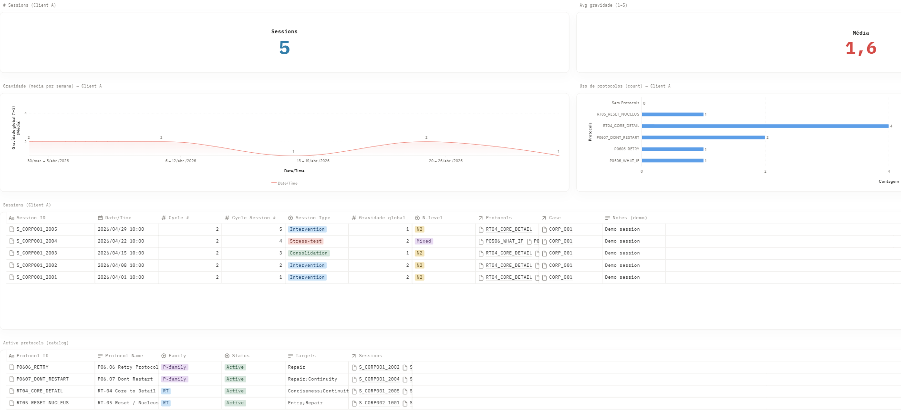
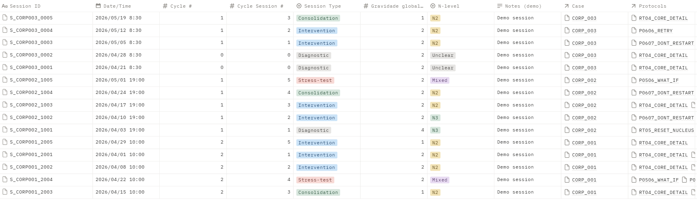

# TEIA — Analytics Engineering Portfolio (Data Ops + Governance)

This is a public portfolio repository documenting a BI-friendly operational data model for a service domain (TEIA), with an emphasis on:
- data modeling (Cases / Sessions / Protocols)
- governance (controlled vocabularies + capture standards)
- traceability (protocol usage tracked per session)
- dashboard-ready structure

> Privacy note: no real client data is published here. The dataset in [`sample-data/`](sample-data/) is fictional. See [`docs/06-privacy.md`](docs/06-privacy.md).
## Screenshots (Notion demo, fictional data)

---

## What’s inside

### Documentation
- [Context](docs/01-context.md)
- [Glossary (domain terms)](docs/02-glossary.md)
- [Data model (entities + relationships)](docs/03-data-model.md)
- [Governance (capture standards)](docs/04-governance.md)
- [Dashboards (concept/spec)](docs/05-dashboards.md)
- [Privacy](docs/06-privacy.md)

### Demo dataset (fictional)
Folder: [`sample-data/`](sample-data/)

Tables:
- [`cases.csv`](sample-data/cases.csv)
- [`sessions.csv`](sample-data/sessions.csv)
- [`protocols.csv`](sample-data/protocols.csv)
- [`session_protocols.csv`](sample-data/session_protocols.csv)

Relationship summary:
- Cases 1 — N Sessions
- Sessions N — N Protocols (via [`session_protocols.csv`](sample-data/session_protocols.csv))

---

## How to explore (quick)
1) Open [`sample-data/sessions.csv`](sample-data/sessions.csv) and filter by `case_id`.
2) Combine [`sessions.csv`](sample-data/sessions.csv) + [`session_protocols.csv`](sample-data/session_protocols.csv) + [`protocols.csv`](sample-data/protocols.csv) to see which protocols were used per session.
3) Aggregate `global_session_severity (TEIA, 1–5)` over time to simulate a stability monitoring view.

---

## Notes
- Domain terms (TEIA / N-level / protocol) are explained in [`docs/02-glossary.md`](docs/02-glossary.md).
- This repo focuses on the data model and governance, not on publishing client narratives or the full methodology.
